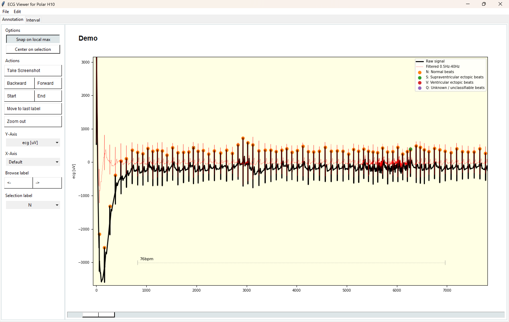

# CSV-Viewer-App


**Version:** 1.0.0  
**Release Date:** 2025-08-08 (yyyy-mm-dd)  
**Author:** Victor Gutgesell (gutvic00)  
**Source:** https://github.com/goodv00/ECGV.git


This is a simple GUI that allows a user to open CSV file, plot one of its columns and mark points in on the plotted line.

It was designed to view ECG recordings made with Polar Sensor Logger (https://play.google.com/store/apps/details?id=com.j_ware.polarsensorlogger&hl=en-US).

---

## Running the project on your machine

This project was creates using Python 3.12.
Make sure to use a virtual environment if working in a shared or production system
```bash
python -m venv .venv
source .venv/bin/activate  # On Windows: .venv\Scripts\activate
```

Update pip to the latest version
```bash
pip install --upgrade pip
```

To install all necessary packages, use:
```bash
pip install -r requirements.txt
```

Once everything is installed run:
```bash
python main.py
```

---

## How to use

This app was created, so you can open and label ECG files. In it, you have a GUI with several tabs that help you inspect a single-lead ECG.
If you want to open a file, go to **> File > Open File** and a pop-up will appear. You can open CSV files and txt files. Per default,
it will plot the first numeric column which does not have the keyword 'time' in it. You can check by looking at the DataHandler object.

There is a demo file in the assets folder of this project.



### How to navigate

You can use your mouse to navigate the plot (this also works on touchscreens)

    - Left click drag --> Pan the graph
    - Right click drag --> Zoom
    - Left click --> Toggle the selected label for the marked data point
    - Scroll --> Zoom x-axis

You also have the option to navigate using your keyboard too

    - Arrow keys --> Pan the graph
    - WADS --> Zoom

When you enter a new tab, it can be that you first need to do a mouse action in the graph before they work.

### Option panel

On the left you have several options and navigation keys.

    - 'Snap on local max' --> If this option is enabled, the selection will automatically snap on a local maximum in the graph (useful if you want to annotate peaks)
    - 'Center after selection' --> Centers the location of your last toggle action (useful when you want to quickly annotate long recordings)
    - 'Take screenshot' --> Kinda obvious... Uses the matplotlib save figure functionality
    - 'Backward' & 'Forward' --> Move the graph by +/- 85% of the visible range
    - 'Start' & 'End' --> Move the graph to the start or end of the recording
    - 'Move to last label' --> Navigates to the last item (highest index) of the selected label
    - 'Zoom out' --> Zooms, so you can see the whole recording on the screen
    - 'Y-axis' --> Chose your y-data if you have multiple plottable axes
    - 'X-axis' --> If you have a time axis the script will find it and convert it to seconds. It will use this data to show ECG paper-like lines in the background. This is not enabled per default because it makes the app less responsive
    - 'Browse label' --> Navigate to the next instance of your selected label
    - 'Selected label' --> The label on which you want to perform actions (toggle or browse)

### Saving files

Go to **> File > Save file as...** to get a save-file dialogue. If you want it quick, use the **> File > Save file...** option.
Files are always saved as .csv with the pandas to_csv method. If you save without the dialogue the filename of the opened file is used (and the original file may be overwritten)

### Labeling
Per default you always have the five standard ECG annotation labels. If you need more, you can create custom labels with **> Edit > Create label**

If you want to change default labels, you can do that in the analysis folder of this project.

The segment annotations work differently than other labels. The only one in the default project is '~'.
This label will signal the program to ignore everything that comes after, until the next other label comes.

### Tabs

In the current version there are two tabs in the app. The first shows a simple x-y plot and lets you annotate the graph. 
The tab 'intervals' is a plot that shows plots of the intervals between the annotated heartbeats (labels that are part of the heartbeat_classes in the default annotations),
and another plot showing the respective heart rate.

## How does it work?!

This app was built specifically to work with output files from Polar Sensor Logger. Nevertheless, it is possible to depict other
CSV data in ECGV.

### Data Handler Class

At the core of this app is the Data Handler class (see modules > data_handler.py) which loads and manages text or CSV files.
It loads CSV data into a Pandas Data Frame. Upon loading the class scans the present column headers to look for labels, plottable axes and time axes.

**Labels** are all columns that start with 'Label: ' and should have either 1 or None values. The data handler class offers methods to manage label data.
It is best to load raw data that does not contain any columns with this prefix present.

**Plottable axes** are columns that feature numeric data and do not have the word 'time' in their column. If you still want to plot time on the y-axis, simply rename the column.
You can use plottable axes as y-data in the app.

**Time axes** are columns that feature numeric data and have the word 'time' present in their name. It will automatically take absolute time and create a new column called 'timer'.
This column is converted to seconds and start at time 0. You can switch the axis in-app if you want to display the time in milliseconds.
You can use time axes as x-data in the app. If there are no time axes, the indices of the y-datapoints are used instead.

Note: the app does thus far not check if the time axes features a steady progression. Therefore, it is up to you to make sure you don't feed the app any nonsense.

### Graph Handler Class

The graph handler deals with the dynamic display of data and the inputs. Key functions to render and remove line plots, scatter plots, etc. can be found here.
Because we want to dynamically display data it is essential to keep a tidy book about the plots in use. This is done in dicts such as scatterdict.

Check the in-code comments for more.

